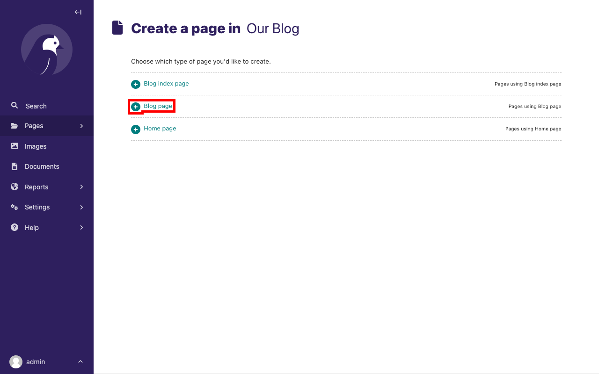

# Blogging with Django: get started with Wagtail

> Available online at [wagtail.org/django-blogging](https://wagtail.org/django-blogging/) / [github.com/thibaudcolas/django-blogging-wagtail](https://github.com/wagtail/django-blogging-wagtail).

👋 welcome to a self-paced Wagtail getting started workshop! This workshop covers:

- Introduction: what’s Wagtail and how it can help
- Initial project setup: `wagtail start`
- Customizing models and views
- Customizing templates
- Deployment!

The workshop was created for live sessions with a mentor – but we expect it can all be done on your own anytime.

## Ahead of the workshop

Please make sure to have the following installed:

- [Python v3.8+](https://www.python.org/) (also includes `pip`)
- Optional, for deployment: [flyctl](https://fly.io/docs/flyctl/), the Fly.io CLI.

## Introduction

- [Wagtail](https://wagtail.org/) as a CMS: Django, content models, admin.
- [The Zen of Wagtail](https://docs.wagtail.org/en/stable/getting_started/the_zen_of_wagtail.html)
  - Wagtail is not an instant website in a box.
  - Always wear the right hat.
  - A CMS should get information out of an editor’s head and into a database, as efficiently and directly as possible.
  - The best user interface for a programmer is usually a programming language.
- [Integrating Wagtail into a Django project](https://docs.wagtail.org/en/stable/getting_started/integrating_into_django.html)

All following sections are self-directed! If you have any questions, please raise your hand or ask in the chat.

## Install and run Wagtail

We will create a new `mysite` directory for our project.

```sh
mkdir mysite
cd mysite
```

### Create and activate a virtual environment

**On Windows** (cmd.exe), run the following commands:

```doscon
py -m venv venv
# then
venv\Scripts\activate.bat
# if venv\Scripts\activate.bat doesn't work, run:
venv\Scripts\activate
```

**On GNU/Linux or MacOS**:

```sh
python -m venv venv
# Then:
source venv/bin/activate
```

### Install Wagtail

To install Wagtail and its dependencies, use pip, which is packaged with Python:

```sh
pip install wagtail
```

### Generate your site

Wagtail provides a `start` command similar to `django-admin startproject`. We will generate the site in the current directory:

```sh
wagtail start mysite .
```

Here is the generated project structure:

```text
mysite/
  .dockerignore
  Dockerfile
  home/
  manage.py*
  mysite/
  requirements.txt
  search/
```

Running `wagtail start mysite` in your project generates a new `mysite` folder with a few Wagtail-specific extras, including the required project settings, a "home" app with a blank `HomePage` model and basic templates, and a sample "search" app.

### Create the database

```sh
python manage.py migrate
```

### Create an admin user

```sh
python manage.py createsuperuser
```

### Start the server

```sh
python manage.py runserver
```

After the server starts, go to <http://127.0.0.1:8000> to see Wagtail’s welcome page:


You can now access the [admin interface](https://guide.wagtail.org/en-latest/concepts/wagtail-interfaces/#admin-interface) by logging into <http://127.0.0.1:8000/admin> with the username and password that you entered while creating an admin user with `createsuperuser`.


## Extend the HomePage model

Out of the box, the "home" app defines a blank `HomePage` model in `models.py`, along with a migration that creates a homepage and configures Wagtail to use it.

Edit `home/models.py` as follows, to add a `body` field to the model:

```python
from django.db import models

from wagtail.models import Page
from wagtail.fields import RichTextField
from wagtail.admin.panels import FieldPanel


class HomePage(Page):
    body = RichTextField(blank=True)

    content_panels = Page.content_panels + [
        FieldPanel('body'),
    ]
```

Define any field you like, just like any Django model! `content_panels` define the capabilities and the layout of the editing interface. Adding fields to `content_panels` enables you to edit them in the CMS.

Run:

```sh
python manage.py makemigrations
python manage.py migrate
```

Here is the expected output from the terminal:

```text
Migrations for 'home':
  home/migrations/0003_homepage_body.py
    - Add field body to homepage
[…]
  Applying home.0003_homepage_body... OK
```

You can now edit the homepage within the Wagtail admin interface. On your [Sidebar](https://guide.wagtail.org/en-latest/how-to-guides/find-your-way-around/#the-sidebar), go to **Pages** and click edit beside **Home** to see the new body field.


Enter the text "Welcome to our new site!" into the body field, and publish the page by selecting **Publish** at the bottom of the page editor, rather than **Save Draft**.

We must update the page template to reflect the changes made
to the model. Wagtail uses normal Django templates to render each page
type. By default, it looks for a template filename formed from the app and model name,
separating capital letters with underscores. For example, `HomePage` within the "home" app becomes
`home/home_page.html`. This template file can exist in any location that
[Django's template rules](https://docs.djangoproject.com/en/stable/intro/tutorial03/#write-views-that-actually-do-something) recognize. Conventionally, you can place it within a `templates` folder within the app.

Edit `home/templates/home/home_page.html` to contain the following:

```html+django


<!-- load wagtailcore_tags by adding this: -->


template-homepage

<!-- replace everything below with: -->

    {{ page.body|richtext }}

```


### Wagtail template tags

Wagtail provides a number of its own [template tags & filters](https://docs.wagtail.org/en/stable/topics/writing_templates.html#template-tags-filters), in addition to to Django's.

We use _richtext_ filter to escape and print the contents
of a `RichTextField`:

```html+django

{{ page.body|richtext }}
```

Produces:

```html
<p>Welcome to our new site!</p>
```

## A basic blog

You are now ready to create a blog, use the following command line to create a new app in your Wagtail project.

```sh
python manage.py startapp blog
```

Add the new `blog` app to `INSTALLED_APPS` in `mysite/settings/base.py`.

```python
INSTALLED_APPS = [
    "blog", # <- Our new blog app.
    "home",
    "search",
    "wagtail.contrib.forms",
    "wagtail.contrib.redirects",
    "wagtail.embeds",
    "wagtail.sites",
    "wagtail.users",
    #... other packages
]
```

### Blog index and posts

Start with creating a simple index page for your blog. Edit `blog/models.py` to include:

```python
from django.db import models

# Add these:
from wagtail.models import Page
from wagtail.fields import RichTextField
from wagtail.admin.panels import FieldPanel


class BlogIndexPage(Page):
    intro = RichTextField(blank=True)

    content_panels = Page.content_panels + [
        FieldPanel('intro')
    ]
```

Since we added a new model to your app, you must create and run a database migration:

```sh
python manage.py makemigrations
python manage.py migrate
```

Now we can create a template at `blog/templates/blog/blog_index_page.html` to render the blog index page.
In your `blog_index_page.html` file enter the following content:

```html+django




template-blogindexpage


    <h1>{{ page.title }}</h1>

    <div class="intro">{{ page.intro|richtext }}</div>

    
        <h2><a href="">{{ post.title }}</a></h2>
        {{ post.specific.intro }}
        {{ post.specific.body|richtext }}
    


```

Note `get_children` and the `pageurl` tag. They’re fundamental elements of how Wagtail routes page views.

Now that this is complete, here is how you can create a page from the CMS:

1. Go to <http://127.0.0.1:8000/admin> and sign in with your admin user details.
2. In the Wagtail [admin interface](https://guide.wagtail.org/en-latest/concepts/wagtail-interfaces/#admin-interface), go to Pages, then click Home.
3. Add a child page to the Home page by clicking **...** at the top of the screen and selecting the option **Add child page**.
4. Choose **Blog index page** from the list of the page types.
5. Use "Our Blog" as your page title, make sure it has the slug "blog" on the Promote tab, and publish it.

You can now access the URL, <http://127.0.0.1:8000/blog> on your site. Note how the slug from the Promote tab defines the page URL.

Now create a model and template for your blog posts. Edit `blog/models.py` to include:

```python
from django.db import models
from wagtail.models import Page
from wagtail.fields import RichTextField
from wagtail.admin.panels import FieldPanel

# add this:
from wagtail.search import index

# keep the definition of BlogIndexPage model, and add the BlogPage model:

class BlogPage(Page):
    date = models.DateField("Post date")
    intro = models.CharField(max_length=250)
    body = RichTextField(blank=True)

    search_fields = Page.search_fields + [
        index.SearchField('intro'),
        index.SearchField('body'),
    ]

    content_panels = Page.content_panels + [
        FieldPanel('date'),
        FieldPanel('intro'),
        FieldPanel('body'),
    ]
```

We’ve added new fields, and this time – made them searchable. Let’s migrate again:

```sh
python manage.py makemigrations
python manage.py migrate
```

Create a new template file at the location `blog/templates/blog/blog_page.html`. Now add the following content to your `blog_page.html` file:

```html+django




template-blogpage


    <h1>{{ page.title }}</h1>
    <p class="meta">{{ page.date }}</p>

    <div class="intro">{{ page.intro }}</div>

    {{ page.body|richtext }}

    <p><a href="{{ page.get_parent.url }}">Return to blog</a></p>


```

Note the use of Wagtail's built-in `get_parent()` method to obtain the
URL of the blog this post is a part of.

Now, go to your admin interface and create a few blog posts as children of `BlogIndexPage` by following these steps:

1. Click **Pages** from the Wagtail [Sidebar](https://guide.wagtail.org/en-latest/how-to-guides/find-your-way-around/#the-sidebar), and then click **Home**
2. Hover on **Our blog** and click **Add child page**.


Select the page type, **Blog page**:



Populate the fields with the content of your choice:


To add a link from your rich text **Body** field, highlight the text you want to attach the link to. You can now see a pop-up modal which has several actions represented by their icons. Click on the appropriate icon to add a link. You can also click the **+** icon, which appears at the left-hand side of the field to get similar actions as those shown in the pop-up modal.

To add an image, press enter to move to the next line in the field. Then click the **+** icon and select **Image** from the list of actions to add an image.

Publish each blog post when you are done editing.

Congratulations! You now have the beginnings of a working blog. If you go to
<http://127.0.0.1:8000/blog> in your browser, you can see all the posts that you created by following the preceding steps:


Titles should link to post pages, and a link back to the blog's homepage should appear in the footer of each post page.

### Parents and children

Much of the work in Wagtail revolves around the concept of _hierarchical tree structures_ consisting of nodes and leaves. In this case, the `BlogIndexPage` serves as a _node_, and individual `BlogPage` instances represent the _leaves_.

Take another look at the guts of `blog_index_page.html`:

```html+django

    <h2><a href="">{{ post.title }}</a></h2>
    {{ post.specific.intro }}
    {{ post.specific.body|richtext }}

```

Every "page" in Wagtail can call out to its parent or children
from its position in the hierarchy. But why do you have to
specify `post.specific.intro` rather than `post.intro`?
This has to do with the way you define your model, `class BlogPage(Page)`. The `get_children()` method gets you a list of instances of the `Page` base class.
When you want to reference properties of the instances that inherit from the base class,
Wagtail provides the `specific` method that retrieves the actual `BlogPage` record.
While the "title" field is present on the base `Page` model, "intro" is only present
on the `BlogPage` model. So you need `.specific` to access it.

You can simplify the template code by using the Django `with` tag. Now, modify your `blog_index_page.html`:

```html+django

    
        <h2><a href="">{{ post.title }}</a></h2>
        <p>{{ post.intro }}</p>
        {{ post.body|richtext }}
    

```

When you start writing more customized Wagtail code, you'll find a whole set of QuerySet
modifiers to help you navigate the hierarchy.

```python
# Given a page object 'somepage':
MyModel.objects.descendant_of(somepage)
child_of(page) / not_child_of(somepage)
ancestor_of(somepage) / not_ancestor_of(somepage)
parent_of(somepage) / not_parent_of(somepage)
sibling_of(somepage) / not_sibling_of(somepage)
# ... and ...
somepage.get_children()
somepage.get_ancestors()
somepage.get_descendants()
somepage.get_siblings()
```

For more information, see [Page QuerySet reference](https://docs.wagtail.org/en/stable/reference/pages/queryset_reference.html#page-queryset-reference)

### Overriding Context

With a keen eye, you may have noticed problems with the `Our blog` page:

1. `Our blog` orders posts in chronological order. Generally blogs display content in _reverse_ chronological order.
2. `Our blog` displays all content. You want to make sure that it displays only _published_ content.

To accomplish these, you need to do more than grab the index
page's children in the template. Instead, you want to modify the
QuerySet in the model definition. Wagtail makes this possible via
the `get_context()` method, which we will override.

Modify your `BlogIndexPage` model:

```python
class BlogIndexPage(Page):
    intro = RichTextField(blank=True)
    # add the get_context method:
    def get_context(self, request):
        # Update context to include only published posts, in reverse-chronological order.
        context = super().get_context(request)
        blogpages = self.get_children().live().order_by('-first_published_at')
        context['blogpages'] = blogpages
        return context

    # ...
```

You also need to modify your `blog_index_page.html` template slightly. Change:

`` to ``

Now, unpublish one of your posts. The unpublished post should disappear from your blog's index page. Also, the remaining posts should now be sorted with the most recently published posts coming first.

## Deployment

We’re going to use Fly.io. First, we need to [install flyctl](https://fly.io/docs/hands-on/install-flyctl/). View Wagtail’s [full tutorial on deployment](https://docs.wagtail.org/en/stable/tutorial/deployment.html) for full information.

Once you’re signed up and verified, run `fly launch` and:

| Question                                                | Instruction                                                                                                                              |
| ------------------------------------------------------- | ---------------------------------------------------------------------------------------------------------------------------------------- |
| Choose an app name                                      | Enter a name of your choice. For example, _yourname-wagtail-portfolio_                                                                   |
| Choose a region for deployment                          | Select the region closest to the _AWS_S3_REGION_NAME_ in your _env.production_ file.                                                     |
| Overwrite ".../.dockerignore"?                          | Enter _y_                                                                                                                                |
| Overwrite ".../Dockerfile"?                             | Enter _y_                                                                                                                                |
| Would you like to set up a Postgresql database now?     | Enter _y_                                                                                                                                |
| Select configuration                                    | select _Development - Single node, 1x shared CPU, 256MB RAM, 1GB disk_ if available. Otherwise, select the smallest configuration option |
| Scale single node pg to zero after one hour?            | Enter _y_                                                                                                                                |
| Would you like to set up an Upstash Redis database now? | Enter _n_                                                                                                                                |

We will need to make one change to the Dockerfile – add a `collectstatic` before `EXPOSE 8000`:

```Dockerfile
RUN python manage.py collectstatic --noinput --clear
```

Add the following to your `.gitignore` file to make Git ignore your environment files:

```text
.env*
```

Also, add the following to your `.dockerignore` file to make Docker ignore your environment and media files:

```text
.env*
media
```

Now add your production dependencies by replacing the content of your `requirements.txt` file with the following:

```text
Django>=4.2,<5.1
wagtail>=6.1,<6.2
gunicorn>=21.2.0,<22.0.0
psycopg[binary]>=3.1.10,<3.2.0
dj-database-url>=2.1.0,<3.0.0
whitenoise>=5.0,<5.1
django-storages[s3]>=1.14.0,<2.0.0
```

Replace the content of your `mysite/settings/production.py` file with the following:

```python
import os
import random
import string
import dj_database_url

from .base import *

DEBUG = False

DATABASES = {
    "default": dj_database_url.config(conn_max_age=600, conn_health_checks=True)
}

SECRET_KEY = os.environ["SECRET_KEY"]

SECURE_PROXY_SSL_HEADER = ("HTTP_X_FORWARDED_PROTO", "https")

SECURE_SSL_REDIRECT = True

ALLOWED_HOSTS = os.getenv("DJANGO_ALLOWED_HOSTS", "*").split(",")

CSRF_TRUSTED_ORIGINS = os.getenv("DJANGO_CSRF_TRUSTED_ORIGINS", "").split(",")

EMAIL_BACKEND = "django.core.mail.backends.console.EmailBackend"

MIDDLEWARE.append("whitenoise.middleware.WhiteNoiseMiddleware")
STORAGES["staticfiles"]["BACKEND"] = (
    "whitenoise.storage.CompressedManifestStaticFilesStorage"
)

if "BUCKET_NAME" in os.environ:
    AWS_STORAGE_BUCKET_NAME = os.getenv("BUCKET_NAME")
    AWS_S3_REGION_NAME = os.getenv("AWS_REGION")
    AWS_S3_ENDPOINT_URL = os.getenv("AWS_ENDPOINT_URL_S3")
    AWS_S3_ACCESS_KEY_ID = os.getenv("AWS_ACCESS_KEY_ID")
    AWS_S3_SECRET_ACCESS_KEY = os.getenv("AWS_SECRET_ACCESS_KEY")

    INSTALLED_APPS.append("storages")

    STORAGES["default"]["BACKEND"] = "storages.backends.s3boto3.S3Boto3Storage"

    AWS_S3_OBJECT_PARAMETERS = {
        "CacheControl": "max-age=86400",
    }

LOGGING = {
    "version": 1,
    "disable_existing_loggers": False,
    "handlers": {
        "console": {
            "class": "logging.StreamHandler",
        },
    },
    "loggers": {
        "django": {
            "handlers": ["console"],
            "level": os.getenv("DJANGO_LOG_LEVEL", "INFO"),
        },
    },
}

WAGTAIL_REDIRECTS_FILE_STORAGE = "cache"

try:
    from .local import *
except ImportError:
    pass
```

Now, create a `.env.production` file as follows, replacing the hostname with your app name:

```text
DJANGO_ALLOWED_HOSTS=<your app name>.fly.dev
DJANGO_CSRF_TRUSTED_ORIGINS=https://<your app name>.fly.dev
DJANGO_SETTINGS_MODULE=mysite.settings.production
```

Set the secrets for Fly.io to use by running:

```sh
flyctl secrets import < .env.production
```

On Windows, run the following command in your PowerShell MSI:

```doscon
Get-Content .env.production | flyctl secrets import
```

Finally, deploy your site to Fly.io by running the following command:

```sh
fly deploy --ha=false
```

```{note}
Running "fly deploy" creates two machines for your app. Using the "--ha=false" flag creates one machine for your app.
```

Congratulations! Your site is now live. However, we must first set up the database and add content to the site. Start by creating an admin user for your live site. `migrate`, `createsuperuser`, you know the drill.

Let’s SSH into the machine to run those commands:

```sh
flyctl ssh console
```

## Congratulations!

You completed this tutorial 🥳

## Where next

- Go through the [full Wagtail getting started guide and tutorial](https://docs.wagtail.org/en/stable/getting_started/index.html) (3-5h)
- Try a paid self-paced course like [The Ultimate Wagtail Developers Course](https://learnwagtail.com/courses/the-ultimate-wagtail-developers-course/)
- Get [instructor-led Wagtail CMS developer training](https://torchbox.com/services/wagtail-cms-services/wagtail-developer-training/)

Or, learn more about Wagtail on [wagtail.org](https://wagtail.org/) :)
